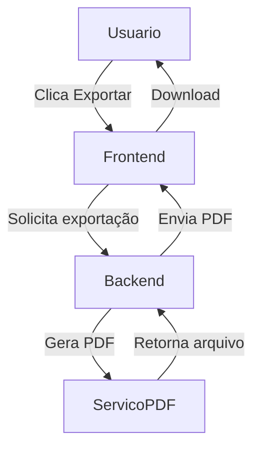

# Documento de Design — Exportação de Relatórios em PDF

---

## **Propósito**: Detalhar a solução técnica para a exportação de relatórios em PDF, garantindo clareza e rastreabilidade.

## Visão Geral

Esta feature permite que usuários autorizados exportem relatórios do sistema em formato PDF, incluindo dados filtrados e gráficos, para compartilhamento externo.

### Objetivos

- Permitir exportação de qualquer relatório visualizado para PDF
- Garantir que apenas usuários autorizados possam exportar
- Manter fidelidade visual dos gráficos no PDF

### Não-Objetivos

- Exportação em outros formatos (ex: Excel)
- Agendamento automático de exportações

## Arquitetura

### Análise da Arquitetura Existente

- O sistema já possui geração de relatórios em tela
- Não há exportação nativa para PDF
- Permissões de usuário já são controladas por roles

### Padrão de Arquitetura & Mapa de Fronteiras

- Padrão selecionado: MVC com serviço externo para renderização de PDF
- Limites: Apenas módulo de relatórios será alterado
- Novos componentes: Serviço de exportação PDF
- Conformidade: Segue princípios de separação de responsabilidades

### Stack Tecnológica

| Camada              | Escolha / Versão | Papel na Feature        | Observações               |
| ------------------- | ---------------- | ----------------------- | ------------------------- |
| Frontend            | Vue 3            | Botão e feedback visual | Usa biblioteca jsPDF      |
| Backend             | FastAPI (Python) | Endpoint de exportação  | Chama serviço de PDF      |
| Dados/Armazenamento | SQLite           | Origem dos dados        | Sem alterações            |
| Infraestrutura      | Docker           | Deploy e isolamento     | Reutiliza stack existente |

## Fluxos do Sistema

## Rastreabilidade de Requisitos

| Requisito | Resumo                      | Componentes       | Interfaces         | Fluxos          |
| --------- | --------------------------- | ----------------- | ------------------ | --------------- |
| 1.1       | Exportação de relatório PDF | Frontend, Backend | API Export, PDFSvc | Exportação PDF  |
| 2.1       | Permissões de exportação    | Backend           | Auth API           | Controle Acesso |

## Componentes e Interfaces

| Componente       | Domínio/Camada | Intenção                        | Cobertura Req | Dependências-Chave | Contratos    |
| ---------------- | -------------- | ------------------------------- | ------------- | ------------------ | ------------ |
| BotãoExportarPDF | UI             | Aciona exportação               | 1.1           | jsPDF (P0)         | Serviço      |
| APIExportarPDF   | Backend        | Recebe requisição e valida perm | 1.1, 2.1      | Auth API (P0)      | API, Serviço |
| ServicoPDF       | Backend        | Gera PDF a partir dos dados     | 1.1           | jsPDF (P0)         | Serviço      |

- BotãoExportarPDF: Exibe feedback visual e inicia fluxo
- APIExportarPDF: Valida permissão e orquestra geração
- ServicoPDF: Converte dados e gráficos em PDF
