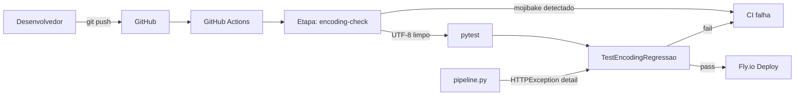

# Design Técnico — pipeline-encoding-fix

---

## Visão Geral

Esta feature corrige e hardeniza a integridade de encoding das strings em português no módulo `backend/app/api/pipeline.py` do ReqSys v2 Enterprise. Entrega testes de regressão que verificam o conteúdo das mensagens de erro e um gate no CI que bloqueia mojibake antes que chegue ao deploy no Fly.io.

**Propósito**: Garantir que mensagens de erro em português retornadas pela API sejam legíveis (ex: `'Integração'` e não `'Integração'`), com prevenção automática de regressão.  
**Usuários**: Desenvolvedores do ReqSys (via CI) e consumidores da API (via respostas HTTP).  
**Impacto**: Acrescenta dois controles ausentes ao ciclo de desenvolvimento — verificação de encoding no CI e assertions de conteúdo nos testes de feature flag.

### Objetivos

- Verificar e corrigir quaisquer strings mojibake em `pipeline.py`
- Adicionar testes que assertam o conteúdo do campo `detail` nas respostas 409
- Implementar step de grep no CI que falha rapidamente ao detectar padrões de mojibake
- Servir de modelo para specs de encoding de outros módulos

### Fora do Escopo

- Suporte a múltiplos idiomas (i18n/l10n)
- Correção de encoding em módulos além de `pipeline.py` e `github_redmine.py`
- Pre-commit hooks locais de desenvolvedor
- Alterações em schema de banco de dados

---

## Arquitetura

### Análise da Arquitetura Existente

O ReqSys v2 usa FastAPI com roteamento modular. `pipeline.py` registra seu router em `main.py` via `app.include_router(pipeline.router)`. Testes usam `pytest` + `httpx.TestClient` via fixture `client` em `conftest.py`. O CI existe em `.github/workflows/` mas não inclui verificação de encoding.

Nenhuma mudança arquitetural é necessária — a feature se encaixa nos padrões existentes.

### Mapa de Componentes



### Stack Tecnológica

| Camada | Tecnologia / Versão | Papel nesta Feature |
|---|---|---|
| Backend | FastAPI + Python 3.12 | Módulo a corrigir (`pipeline.py`) |
| Testes | pytest + httpx (existente) | Nova classe de regressão de encoding |
| CI | GitHub Actions (existente) | Novo step de grep antes dos testes |
| Runtime | Fly.io / container Debian | Destino do deploy; verificar `PYTHONIOENCODING` |

Sem novas dependências externas.

---

## Fluxo do Sistema

```mermaid
sequenceDiagram
    participant CI as GitHub Actions
    participant grep as Etapa encoding-check
    participant pytest as pytest
    participant API as ReqSys Pipeline API

    CI->>grep: grep -rn "ç|ã|é" backend/app/api/*.py
    alt mojibake encontrado
        grep-->>CI: exit 1 — arquivo:linha
        CI-->>CI: job falha (deploy bloqueado)
    else UTF-8 limpo
        grep-->>CI: exit 0
        CI->>pytest: pytest backend/tests/test_pipeline.py
        pytest->>API: POST /v1/integracoes/github/issues (flag OFF)
        API-->>pytest: 409 detail="Integração GitHub→Redmine..."
        pytest->>pytest: assert "Integração" in detail
        alt assertion falhou
            pytest-->>CI: FAILED TestEncodingRegressao
            CI-->>CI: job falha
        else assertion passou
            pytest-->>CI: PASSED
            CI->>CI: deploy permitido
        end
    end
```



---

## Rastreabilidade de Requisitos

| Requisito | Resumo | Componentes | Interfaces | Fluxos |
|---|---|---|---|---|
| 1.1 | Strings UTF-8 corretas no source | PipelineModule | — | Encoding Check |
| 1.2 | Response JSON sem mojibake | PipelineModule, PipelineEncodingTests | HTTPException | Teste → API |
| 1.3 | Mojibake = estado inválido bloqueado | CIEncodingCheck | Grep step | CI |
| 2.1 | `detail` de `/v1/integracoes/github/issues` legível | PipelineModule, PipelineEncodingTests | HTTPException.detail | Teste → API |
| 2.2 | `detail` de `/v1/backlog/publicar-redmine` legível | PipelineModule, PipelineEncodingTests | HTTPException.detail | Teste → API |
| 2.3 | Content-Type com charset=utf-8 | PipelineModule | HTTP Header | Teste → API |
| 2.4 | Mojibake em detail = defeito bloqueado | PipelineModule, CIEncodingCheck | — | CI + Testes |
| 3.1 | Teste asserta "Integração" no detail (issues) | PipelineEncodingTests | assert detail | Teste |
| 3.2 | Teste valida decodificação UTF-8 sem UnicodeDecodeError | PipelineEncodingTests | json.loads | Teste |
| 3.3 | Falha mostra string recebida vs. esperada | PipelineEncodingTests | pytest output | Teste |
| 3.4 | Cobertura dos dois endpoints afetados | PipelineEncodingTests | — | Teste |
| 4.1 | grep detecta padrões mojibake em `backend/app/api/` | CIEncodingCheck | grep | CI |
| 4.2 | CI falha com arquivo:linha ao detectar | CIEncodingCheck | exit 1 | CI |
| 4.3 | Encoding check antes dos testes unitários | CIEncodingCheck | step order | CI |

---

## Componentes e Interfaces

### Resumo

| Componente | Camada | Intenção | Requisitos | Dependências P0 | Contratos |
|---|---|---|---|---|---|
| PipelineModule | Backend API | Corrigir strings; garantir HTTPException com UTF-8 | 1.1, 1.2, 1.3, 2.1–2.4 | FastAPI, github_redmine | Service |
| PipelineEncodingTests | Testes | Assertar conteúdo de detail e encoding das respostas | 3.1–3.4, 2.1–2.4 | httpx TestClient, pytest, monkeypatch | — |
| CIEncodingCheck | CI / Infraestrutura | Step grep antes dos testes; falha ao detectar mojibake | 4.1–4.3, 1.3 | GitHub Actions runner (grep disponível) | Batch |

---

### Backend API

#### PipelineModule

| Campo | Detalhe |
|---|---|
| Intenção | Módulo FastAPI com endpoints de pipeline; deve ter todas as strings literais em UTF-8 correto |
| Requisitos | 1.1, 1.2, 1.3, 2.1, 2.2, 2.3, 2.4 |

**Responsabilidades e Restrições**

- Strings Python são objetos Unicode — a corretude depende do encoding do arquivo de source salvo no disco
- `HTTPException(detail=...)` propaga o `detail` como string para o corpo JSON; FastAPI serializa com `ensure_ascii=False`
- Nenhuma alteração de lógica de negócio; apenas correção de literais se necessário

**Dependências**

- Inbound: `main.py` — registra o router (P0)
- Outbound: `github_redmine.py` — `github_redmine_import_enabled()`, `fetch_github_issues()`, `publish_*` (P1)
- External: FastAPI `HTTPException` — propaga detail como JSON (P0)

**Contratos**: Service [x] / API [ ] / Event [ ] / Batch [ ] / State [ ]

##### Interface de Serviço (Python)

```python
# Endpoints relevantes para encoding — sem mudança de assinatura
@router.post('/v1/integracoes/github/issues')
def listar_issues_github(
    payload: GitHubIssuesIn,
    x_correlation_id: str | None = Header(default=None),
) -> dict: ...
# HTTPException(status_code=409, detail='Integração GitHub→Redmine desabilitada por feature flag.')

@router.post('/v1/backlog/publicar-redmine/{requisito_id}')
def publicar_redmine(
    requisito_id: int,
    payload: PublicarRedmineIn | None = None,
    db: Session = Depends(get_db),
    x_correlation_id: str | None = Header(default=None),
) -> dict: ...
# HTTPException(status_code=409, detail='Integração GitHub→Redmine desabilitada por feature flag.')
```

**Notas de Implementação**

- Verificar o arquivo salvo com editor configurado em UTF-8 sem BOM
- Se qualquer string estiver com mojibake, substituir pelo caractere correto
- Não é necessário `# -*- coding: utf-8 -*-` — Python 3.12 usa UTF-8 por padrão

---

### Testes

#### PipelineEncodingTests

| Campo | Detalhe |
|---|---|
| Intenção | Nova classe de testes que asserta encoding correto nos campos `detail` das respostas 409 do pipeline |
| Requisitos | 3.1, 3.2, 3.3, 3.4, 2.1, 2.2, 2.3 |

**Responsabilidades e Restrições**

- Não duplicar a lógica de negócio dos testes existentes — focar exclusivamente em encoding
- Usar `monkeypatch` para isolar dependências externas (GitHub API, Redmine)
- Falha deve exibir string recebida vs. esperada (pytest faz isso automaticamente com `assert "x" in y`)

**Dependências**

- Inbound: pytest runner (P0)
- Outbound: `httpx.TestClient` via fixture `client` (P0), `monkeypatch` (P1)
- External: nenhuma

**Contratos**: Service [ ] / API [ ] / Event [ ] / Batch [ ] / State [ ]

##### Interface de Testes (Python)

```python
class TestEncodingRegressao:
    EXPECTED_DETAIL = 'Integração GitHub→Redmine desabilitada por feature flag.'

    def test_github_issues_flag_off_detail_utf8(
        self, client: TestClient, monkeypatch: pytest.MonkeyPatch
    ) -> None:
        """Req 3.1, 2.1: detail contém 'Integração' sem mojibake."""
        ...

    def test_publicar_redmine_flag_off_detail_utf8(
        self, client: TestClient, monkeypatch: pytest.MonkeyPatch
    ) -> None:
        """Req 3.4, 2.2: cobertura do segundo endpoint afetado."""
        ...

    def test_response_decodifica_utf8_sem_erro(
        self, client: TestClient, monkeypatch: pytest.MonkeyPatch
    ) -> None:
        """Req 3.2: json.loads(response.text) não lança UnicodeDecodeError."""
        ...

    def test_content_type_charset_utf8(
        self, client: TestClient
    ) -> None:
        """Req 2.3: Content-Type inclui charset=utf-8."""
        ...
```

**Notas de Implementação**

- Usar o mesmo padrão de `monkeypatch.setattr("app.api.pipeline.github_redmine_import_enabled", lambda: False)` dos testes existentes
- `assert self.EXPECTED_DETAIL in resp.json()["detail"]` — pytest imprime ambos os valores na falha automaticamente (Req 3.3)
- Para `test_content_type_charset_utf8`, usar qualquer endpoint que retorne JSON; a fixture `client` já inclui o app completo

---

### CI / Infraestrutura

#### CIEncodingCheck

| Campo | Detalhe |
|---|---|
| Intenção | Step de grep no CI que detecta padrões de mojibake em arquivos Python antes dos testes unitários |
| Requisitos | 4.1, 4.2, 4.3, 1.3 |

**Responsabilidades e Restrições**

- Deve ser executado **antes** do step de `pytest` no mesmo job de CI
- grep disponível em todos os runners `ubuntu-latest` do GitHub Actions
- Escopo: `backend/app/api/*.py` (pode ser expandido a `backend/app/services/*.py` sem impacto)

**Dependências**

- Inbound: GitHub Actions job (P0)
- External: `grep` (GNU grep, disponível no runner) (P0)

**Contratos**: Service [ ] / API [ ] / Event [ ] / Batch [x] / State [ ]

##### Contrato de Batch (CI Step)

- **Trigger**: push/PR para qualquer branch com mudanças em `backend/`
- **Input**: arquivos `.py` em `backend/app/api/` e `backend/app/services/`
- **Validação**: grep por padrões de mojibake literais: `ç`, `ã`, `é`, `á`, `Ã\xba`
- **Output/Destino**: exit 0 (limpo) → próximo step; exit 1 (mojibake encontrado) → job falha com linha de saída indicando arquivo:número
- **Idempotência**: grep é stateless e idempotente

```yaml
# Trecho a adicionar no workflow CI do reqsys-v2-enterprise-real
- name: Verificar encoding UTF-8 (anti-mojibake)
  run: |
    echo "Verificando strings com mojibake em backend/app/api/ e backend/app/services/ ..."
    if grep -rn --include="*.py" -E "ç|ã|é|á|ú" backend/app/api/ backend/app/services/; then
      echo "ERRO: Strings com mojibake encontradas. Corrija o encoding do arquivo antes do commit."
      exit 1
    fi
    echo "OK: Nenhum mojibake encontrado."
```

**Notas de Implementação**

- Posicionar antes do step `pytest` (Req 4.3)
- A saída do grep já inclui `arquivo:linha:conteúdo` — satisfaz Req 4.2 sem lógica adicional
- O `if grep ... ; then ... exit 1` garante que exit 0 do grep (nada encontrado) passa normalmente

---

## Estratégia de Testes

### Testes Unitários / Integração (pytest)

1. `test_github_issues_flag_off_detail_utf8` — assert do `detail` no endpoint `/v1/integracoes/github/issues` com flag OFF
2. `test_publicar_redmine_flag_off_detail_utf8` — assert do `detail` no endpoint `/v1/backlog/publicar-redmine/{id}` com flag OFF e `use_github_import=True`
3. `test_response_decodifica_utf8_sem_erro` — `json.loads(resp.text)` deve completar sem `UnicodeDecodeError`
4. `test_content_type_charset_utf8` — `resp.headers["content-type"]` deve conter `charset=utf-8`

### CI (grep)

- Padrões testados: `ç` (ç), `ã` (ã), `é` (é), `á` (á), `ú` (ú)
- Cobertura: todos os arquivos `.py` em `backend/app/api/` e `backend/app/services/`
- Falha rápida: o step é executado antes do pytest

---

## Tratamento de Erros

### Estratégia

Falha rápida em ambas as camadas (CI e testes). Mensagens de erro humanas e específicas.

### Categorias

| Origem | Erro | Resposta |
|---|---|---|
| CI grep (4.x) | Mojibake encontrado no source | Exit 1; grep imprime `arquivo:linha:conteúdo`; deploy bloqueado |
| pytest TestEncodingRegressao | `detail` contém mojibake | `AssertionError` com diff automático do pytest (`assert "Integração" in "Integração"`) |
| pytest TestEncodingRegressao | `UnicodeDecodeError` | Traceback pytest; indica problema de serialização no FastAPI |

### Monitoramento

- Sem monitoramento de runtime necessário — o problema é de source code, não de estado em produção
- Logs do CI job são suficientes para diagnóstico
